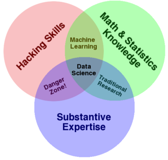
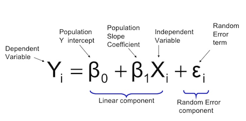
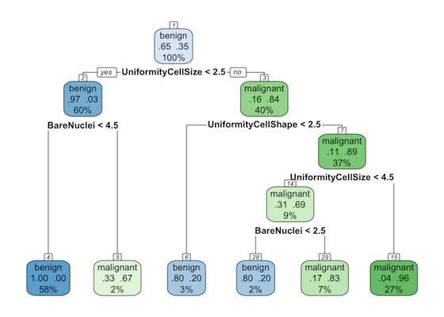
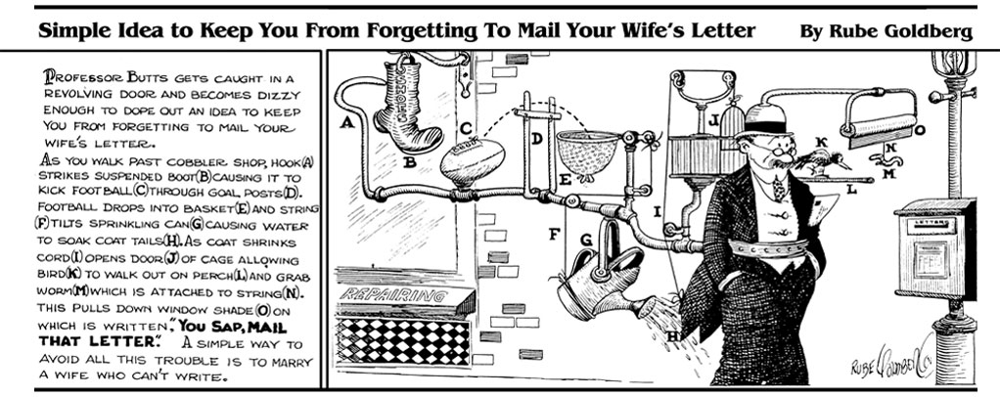

<style>
  slides > slide.title-slide {
    background-color: white;
    background-image: -webkit-linear-gradient(120deg, white 70%, orange 30%);
    min-height: 500px;
  }
  slides  > slide.current-slide {
    background-color: white;
    background-image: -webkit-linear-gradient(120deg, lightorange 80%,  white 20%);
    min-height: 500px;
  }
  slides {
    background-color: grey;
  }
  h2 {
    font-size: 2em;
  }
  h1 {
    color: darkslategrey;
  }
  h3 {
    color: darkorange;
  }
  
  strong {
    color: blue;
  }
  i {
    color: orange;
  }
</style>

#  Simple Goal

Give food for thought. 

#  Roadmap

__Part 1: A Conceptual Overview__

- Where the field of data science is going outside of BEA? 
- What is data science?
- How can it help us in production? How can't it?
- What does a data science entail? 
- Why has it been at odds with some fields?
- How data science fit into the economics and national accounting?
- Why are projects centered around constructing pipelines

__Part 2: Programming Refresher__

- Review of R
- Dissecting a pipeline


#  Applications: Rec Engines

Amazon's recommendation engines examine past purchase behavior to personalize and surface products to relevant consumers.


#  Applications: Satellite imagery  

Orbital Insights deploys computer vision algorithms to count cars at retail store parking lots in order for investors to better approximate quarterly earnings.


#  Applications: Email receipts

Quandl used a panel of email receipts to predict the effects of an Uber platform charge policy. 


#  Applications: Pricing

Zillow collected most of the housing sales data in the US and constructed a price prediction model to help sellers price their homes more competitively when they choose to put the property on the market.


#  Applications: Fire Prediction

FDNY among other city fire departments around train algorithms to predict where fires will in order to target fire safety inspections.


#  Applications: Anomaly Detection

Advanced time series modeling can be used to detect anomalous activity so that online platforms can safeguard their assets.


#  What's the pattern!

All of these examples have a common structure. 

__What is the underlying structure?__


#  Detect the pattern!

- Implies there is an __end user__
- The end user has a __problem__
- __Data__ is available
- A __model__ is used to power the solution 
- The result is __scalable__ and, if necessary, __automated__.


#  Applications: BEA

### What are some good uses of this paradigm at __BEA__? 

###*[Your Ideas Go Here]*

#  Applications: BEA

### What are some good uses of this paradigm at __BEA__? 

- Advanced algorithms for constructing synthetic source data from more timely data in order to reduce revisions
- Anomaly detection applied to source data to flag for analyst quality control review 
- Automated model-based imputation that reduces need for manual adjustments
- News correlation engine to help tell the story behind movements in the data

#  What is it we're talking about? 

Data science has a rather fluffy definition as it is interdisciplinary field. But generally, there is agreement that *data science* sits at the intersection of mathematical inference, computer science and subject matter expertise. 




#  How is data science different from other fields?

Data science uses statistical inference and computational algorithms to develop applications that communicate an actionable insight.

$$\text{Data Science} = f(\text{Statistics, Computer Science})$$

Modern statisticians will claim that data science is no different, but they tend not to operationalize insight. Computer scientists have long developed applications, but are not interested in inference.

$$\text{Statistics} \neq \text{Computer Science} $$

Data science is not social science as it does not rely on formal social theories, but rather starts from the first principles of inference from data.

$$\text{Data Science} \neq \text{Social Science} $$


#  So so so many buzzwords

Data science is also a marketing term and part of a larger universe of buzzwords: 

- __Big Data__
- __Data analytics__
- __Machine Learning__
- __Artificial Intelligence__
- __Data engineering__
- __Deep learning__

#  So so so many buzzwords

Data science is also a marketing term and part of a larger universe of buzzwords: 

- __Big Data__: Data that tends to be available at a high frequency (velocity) with a large quantity (volume), and capturing a broad set of information (variety)
- __Data analytics__: Process of analyzing and surfacing insights from data.
- __Machine Learning__: Statistical techniques that allow computers to learn patterns.
- __Artificial Intelligence__: See above, but applied to solving human tasks.
- __Deep learning__: A branch of machine learning concepts and representations rather than tasks.
- __Data engineering__: Process of engineering software solutions and pipelines for data.


#  What is data science good for? Where does it fall short?

| |Yea|Nay|
|-----------------+----------------------+--------------------|
|Adoption | Embraced mostly in fields where there is a rapid expansion of data and theory has not yet formed | Data science tends to clash with well-established fields. | 
|Interpretation | Underlying skills can be flexibly applied | There isn't a gold standard for how it should be applied. |
|Staffing need | Very few people required to do the job well | Fluffy definition means little quality control of who is a data scientist | 
|Long term outlook| Skills will likely persist into the future | Whereas early days of data science focused on generalist practitioners, future practitioners will be field specific -- re-adsorbed into host field.| 


#  Why economists make for good data scientists?

__Data science has been hyped. It is really easy to get our hands on more data and tech. Many data practitioners will use the tools like tossing spaghetti on walls and hope that something sticks. __


#  Why economists make for good data scientists?

__Who's left? Natural and social scientists like economists who tend to be skeptical. They are good at asking a lot of pointed quesitons.__ 


#  What makes for a good application? 

Applications tend take on one of three forms:


- __Benchmarks__ provide context.
- __Explanations__ describe how phenomena behave (e.g. Visualizations showing precisely what is the impact of droughts on agricultural output)
- __Predictions__ anticipate what will happen in order to inform what you should do (e.g. housing price predictions that help offering price). Note that imputation and advanced outlier detection are forms of prediction.

What we do with the data needs to have a point.


# The Dichotomy of Explanations and Predictions

Models 1 and 2 have been estimated for time series $y$.

```{r,  echo = FALSE, fig.width = 10, fig.height= 4}
par(mfrow = c(1,3))
n <- 100
x <- 1:n
err <- runif(n)*3-runif(n)*3
y1 <- x + runif(n)*30 - runif(n)*30
y2 <- x
plot(x, y1, ylab = "y", xlab = "time", asp = 1, pch = 16, cex = 1.5,col = rgb(0,0,1,1), main = "Actual")

plot(x, y1, ylab = "y", xlab = "time", asp = 1, pch = 16, cex = 1.5,col = rgb(0,0,1,0.3), main = "Model 1 (Red Circles)")
points(x, y1+err, col = "red")

plot(x, y1, ylab = "y", xlab = "time", asp = 1, pch = 16, cex = 1.5,col = rgb(0,0,1,0.4), main = "Model 2 (Orange Circles)")
points(x, y2, col = "orange")

```

- Which graph represents a the __trend__? 
- Which of the following is the better __prediction__?


# The Dichotomy of Explanations and Predictions

Models 1 and 2 have been estimated for time series $y$.


```{r,  echo = FALSE, fig.width = 10, fig.height= 4}
par(mfrow = c(1,3))

plot(x, y1, ylab = "y", xlab = "time", asp = 1, pch = 16, cex = 1.5,col = rgb(0,0,1,1), main = "Actual")

plot(x, y1, ylab = "y", xlab = "time", asp = 1, pch = 16, cex = 1.5,col = rgb(0,0,1,0.3), main = "Model 1 (Red Circles)")
points(x, y1+err, col = "red")

plot(x, y1, ylab = "y", xlab = "time", asp = 1, pch = 16, cex = 1.5,col = rgb(0,0,1,0.4), main = "Model 2 (Orange Circles)")
points(x, y2, col = "orange")

```


- Which graph represents a the __trend__? _Model 2 is likely a simple bivariate regression placing a lot of confidence in one variable to present the trend in $y$ -- high bias_
- Which of the following is the better __prediction__? _Model 1 is more predictive, generated from a more complex model with a nuanced explanation._


# Explanations vs. Predictions

###The trade-off will more often than not be interpretability versus accuracy.

|Story-Driven |  Model-Driven |
|--------------------------------+-----------------------------------|
| Story derived from regression coefficients, but model that has low empirical accuracy.  | The number may be very close to reality, but the model does not lend itself to tell a story.| 
| Tend to place greater weight on a variables. | Tend to focus on minimizing error.|
|  | |


#  What makes for a good application? 

Remainder of today will focus on __prediction__.


#  How are prediction projects typically structured?

```{r, echo = FALSE}
library(DiagrammeR)
mermaid("graph LR
        A[1 - Use Case Statement] --> B[2 - Data Acquisition]
        B --> C[3 - Data Engineering]
        C --> D[4 - Predictive Modeling]
        D --> A
        D --> E[5 - Deployment]
        E --> D",
        width = 1000,
        height = 200)

```

Note: Different companies will have a different ways of describing this process -- it's largely for marketing purposes, but is effectively the same.


#  How are prediction projects typically structured?

```{r, echo = FALSE}
library(DiagrammeR)
mermaid("graph LR
        A[1 - Rec products] --> B[2 - User Purchases]
        B --> C[3 - Cleaned user-purchase matrix]
        C --> D[4 - Cosine similarity]
        D --> A
        D --> E[5 - API call]
        E --> D",
        width = 1000,
        height = 200)

```


###Recommendation engines

Association score can rank relevant products to facilitate sales. User purchases are cleaned and aggregated into a user-product matrix, then cosine similarity is calculated to find which products are correlated with other products. 

#  How are prediction projects typically structured?

```{r, echo = FALSE}
library(DiagrammeR)
mermaid("graph LR
        A[1 - Set housing price] --> B[2 - Housing sales]
        B --> C[3 - Sales price with housing attributes]
        C --> D[4 - Hedonic regression]
        D --> A
        D --> E[5 - API call]
        E --> D",
        width = 1000,
        height = 200)

```


### Housing sales price prediction

Predicted price to help set the asking price. Housing sales records are structured into a cross-sectional data set of housing attributes, then a regression is used to correlated house attributes to the price in order to predict prices of unsold houses. 


#  How are prediction projects typically structured?

```{r, echo = FALSE}
library(DiagrammeR)
mermaid("graph LR
        A[1 - Set expectation on salary] --> B[2 - Job listings]
        B --> C[3 - Salary with job attributes]
        C --> D[4 - Wage regression]
        D --> A
        D --> E[5 - API call]
        E --> D",
        width = 1000,
        height = 200)

```


### Job board salaries

Set expectations of users and facilitates more targeted search. Job listings with salary data are structured into a cross-sectional data set of job attributes, then a regression is used to correlated job attributes to the salary in order to predict salaries for postings that are missing that information. 


#  How are prediction projects typically structured?

```{r, echo = FALSE}
library(DiagrammeR)
mermaid("graph LR
        A[1 - Direct drivers to demand] --> B[2 - Past rides]
        B --> C[3 - Time series by micro-grid]
        C --> D[4 - ARIMA or neural net]
        D --> A
        D --> E[5 - Driver alerts]
        E --> D",
        width = 1000,
        height = 200)

```


### Ride share targeting

Past Uber rides are turned into a time series for every half mile grid cell for a given city. A time series model like ARIMA, Neural Net, Theta Algorithm, Holt-Winters or other method is applied to predict the level of expected ridership over the next few hours. This is then used to send alerts to drivers to direct them to hotbeds.


#  How are prediction projects typically structured?

```{r, echo = FALSE}
library(DiagrammeR)
mermaid("graph LR
        A[1 - Use Case Statement] --> B[2 - Data Acquisition]
        B --> C[3 - Data Engineering]
        C --> D[4 - Predictive Modeling]
        D --> A
        D --> E[5 - Deployment]
        E --> D",
        width = 1000,
        height = 200)

```

All of these cases use terabytes to petabytes of information for daily production. Steps 2 through 5 are engineered as a program that can run on its own. 

###Where do we start?


#  (1) Use Case Statement

Set the initial starting parameters by answering these questions

- __What's the problem?__
- __Who is impacted by the problem? __
- __Under what conditions does the problem exist?__
- __Which decision points can be influenced using better information?__
- __What can be engineered to improve the situation? __
- __What are the success criteria?__


#  (1) Use Case Statement: Example

### Example using __recommendation engines__.

- __What's the problem?__ Sellers have a lot of product to sell, but no easy way to get it in front of prospective buyers.
- __Who is impacted by the problem? __ Sellers - need to sell. Buyers - better buying experience.
- __Under what conditions does the problem exist?__ Online platform searching for products.
- __Which decision points can be influenced using better information?__ Which relevant product and what information to render in the search results to maximize buy chances.
- __What can be engineered to improve the situation? __ Examine past buying behavior to calculate the probability that a given product is co-purchased with another product. In order of highest probability, recommend products.

$$ cos(\theta) = \frac{\sum^n_{i=1}A_iB_i}{\sqrt{\sum^n_{i=1}A_i^2}\sqrt{\sum^n_{i=1}B_i^2}}  $$
- __What are the success criteria?__ Whether recommended products were clicked on, whether recommended products were purchased more than products with lower probability.

#  (1) Use Case Statement: Example

### Example using __NEA QSS__.

- __What's the problem?__ BEA has revisions in GDP components as some data are not available for the advance estimate.
- __Who is impacted by the problem? __ NEA's PCE team.
- __Under what conditions does the problem exist?__ Whenever data are not available for the advance and an extrapolater is required -- Quarterly Service Survey is not available until the 2nd estimate.
- __Which decision points can be influenced using better information?__ Produce extrapolation of the 3rd estimate in time for the advance.
- __What can be engineered to improve the situation? __ Search all available contemporaneous data and train statistical models to mimick series in order to minimize revisions.

| (1) Contemporaneous Model     | (2) Traditional Lag (Momentum) | 
|-----------------------------------+-----------------------------------|
|$$y_t = f(x_t)$$ | $$y_{t} = f(x_{t-1})$$ |

- __What are the success criteria?__ New prediction should be closer to the 3rd estimate than the current state of the art.

#  (2) Data Acquisition

Very few rules except that the data reflect the state of the world at the time of each estimate cycle so that we can simulate forecasting.

### Rec Engine
- Only use products available prior to designated test period.

### QSS Prediction
- QSS and predictors are the same data available before the advance estimate of GDP.


# (3) Data Engineering 

- Cleansing values so that they are standardized
- Reshaping data for appropriate use
- Filling in oddities and missingness in the data
- Ensuring data is treated the same everytime


#  (4) Predictive Modeling

Modeling is typically split between __model training__ and __model validation__.


#  (4) Predictive Modeling: Training

Given a target $y$ and inputs $X$, training means calibrating a machine learning algorithm to mimick Y subject to a loss function.

- __"Algorithm"__: Just means a mathematical function and procedure that can "learn" relationships. This is known as "supervised learning".
- __"Loss Function"__: Algorithms learn relationships iteratively. In each iteration, it gets better like a child learning to stand iteratively. The loss function is what tells the algorithm how far off it is from actual. Examples: Root Mean Squared Error, Mean Absolute Percent Error, Mean Absolute Error.

Goal is to find the model that produces the lowest loss function = highest accuracy.

#  (4) Predictive Modeling: OLS Example

Even regression ($y = \beta_0 + \beta_1 x_i + \epsilon$) is an iterative process minimizing the *mean squared error*.


#  (4) Predictive Modeling: Methods

Modeling in the social sciences tend to focus on parametric methods (e.g. linear regression) as they lend themselves to a story. In data science, the goal is predicting the number, thus methods are far more diverse and more complex.

| __Common Econ Methods__ | __Data Science Methods__|
|--------------------------------+-----------------------------|
| - Linear regression | - Linear regression | 
| - Stepwise regression | - Stepwise regression | 
| - ARIMA | - ARIMA | 
| - Bayesian Vector Autoregression | - Bayesian Vector Autoregression | 
| - Rolling Average | - Regularized regression (LASSO, Ridge, Elastic Net)| 
| | - Neural Networks, LSTM|
| | - Support Vector Machines (SVM, SVR)|
| | - Random Forests |
| | - Boosting (Adaptive, Extreme)|
| | - Ensemble averaging and stacking|
| | - +1000's more |


#  (4) Predictive Modeling - Considering Model Validation Early On

When producing predictions, the data are usually split into a training and testing set.

### Why?


#  (4) Predictive Modeling - Considering Model Validation Early On

Remember the goal is to find the model that has the lowest loss function. As the model iteratively learns from data, it will have seen the data multiple times. It's like allowing a student to cheat off of all other students in the class. 


#  (4) Predictive Modeling - Considering Model Validation Early On

When students learn test answers but not the concept, it is similar to when models learn data values but not the patterns. This is called __overfitting__. 


#  (4) Predictive Modeling - Considering Model Validation Early On

Partitioning the data involves splitting the data into a training set for the student to learn. Then giving it a previously unseen scenario to test it on. 

Would you limbo twice?


#  (4) Predictive Modeling: Example

### QSS Prediction: Goal is to predict revenue for each service sector industry

- Each industry's data is split into "One-Step Ahead" train-test model validation.


- 30,000 different models are then trained and tested keeping only the best models based on out-of-sample.

#  (5) Deployment: Not Rube Goldberg

This sounds too complicated for everyday use.

The beauty of modern technology and techniques is that it can turn tedium into something that is surefire. The goal is to engineer a machine that produces artisan-quality results at the click of a button.



#  (5) Deployment: Not Rube Goldberg

We're really trying to write one program to rule them all. 


#  (5) Deployment: Example


### QSS Prediction

- The entire modeling process only requires that someone point a script at a folder, then returns predictions.


# rubeGoldberg()

Most data production companies in private sector like Bloomberg tend to be vertically integrated so that economic research products are

- co-developed with engineering and economists
- overseen by a product team that understands how data products will be used by customers. 

Everyone tends to know the same code base (e.g. "We are a Python shop")

```{r, echo = FALSE}
library(DiagrammeR)
mermaid("graph LR
        A[Product] --> B[Research]
        A --> C[Engineering]
        C --> A
        B --> C
        C --> B
        A[Product] --> D[Marketing]",
        width = 1000,
        height = 200)

```


# Recap: Can you find a problem you face that fits this framework?
(5 mins)

```{r, echo = FALSE}
library(DiagrammeR)
mermaid("graph LR
        A[1 - Use Case Statement] --> B[2 - Data Acquisition]
        B --> C[3 - Data Engineering]
        C --> D[4 - Modeling]
        D --> A
        D --> E[5 - Deployment]
        E --> D",
        height = 300)

```


# Part II: Code Refresher

Data science generally relies on one of two coding languages: __R__ and __Python__.

Today, we will have a quick refresh of R and walk through two basic scripts that represent how a basic data science project could work.
