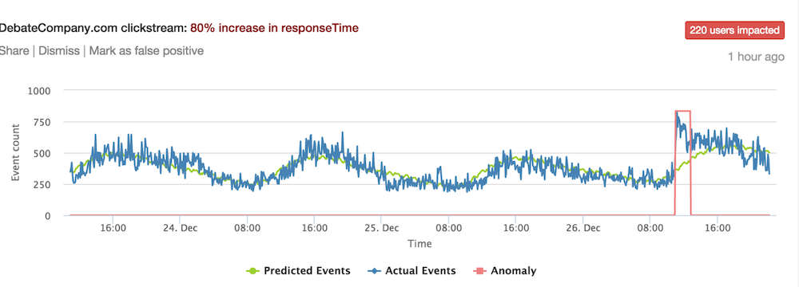

## Today's main takeaway

[]

## Roadmap

__Part 1: A Conceptual Overview__

- Where the field of data science is going outside of BEA? 
- What is data science?
- How can it help us in production? How can't it?
- What does a data science entail? 
- Why has it been at odds with some fields?
- How data science fit into the economics and national accounting?
- Why are projects centered around constructing pipelines

__Part 2: Programming Refresher__

- Review of R
- Dissecting a pipeline

## Applications: Rec Engines

Amazon's recommendation engines examine past purchase behavior to personalize and surface products to relevant consumers.

## Applications: Satellite imagery  

Orbital Insights deploys computer vision algorithms to count cars at retail store parking lots in order for investors to better approximate quarterly earnings.

## Applications: Email receipts

Quandl used a panel of email receipts to predict the effects of an Uber platform charge policy.

## Applications: Pricing

Zillow collected most of the housing sales data in the US and constructed a price prediction model to help sellers price their homes more competitively when they choose to put the property on the market.

## Applications: Anomaly Detection

Advanced time series modeling can be used to detect anomalous activity so that online platforms can safeguard their assets.

## Detect the pattern!

__What do these examples have in common?__
__What is the underlying structure?__

## Detect the pattern!

- Implies there is an end user
- The end user has a problem
- Data is collected
- A model is used to power the solution 
- The result is scalable or automated

## What is it?
- What does data science entail? 

Data science is the confluence of statistical inference, computer science, engineering and subject matter expertise. 

Focused on engineering reliable systems and processes that automate replicable and stable science 

Allows data to take a more active and precise role in operations, rather than requiring human judgment screen each and every step of a task, but allows well-calibrated and designed algorithms to learn patterns in order to make good predictions

It is also important to note that data science is a marketing term

### How is it different from economics? How isn’t it different?

__Similarities__. 

__Differences__.
1. Data science is not concerned with causality. But most of econ isn't either with the exception of what's known as identification problems. In some fields, causality is determined if parameters are placed on the right hand side of the equation in order to infer partial correlations.
- Example: An economist may want to measure the precise drop in gasoline sales after a hurricane. A data scientist would want to predict the drop and ...

2. Most data analysis is intended to crafted a narrative about the trends, which in turn could inform policy and general strategy. Data science gives a voice to the micro details and enables tactical level decisions. 
- Example: Data analysis on e-commerce sales could indicate that Nintendo Switch out sold XBoxes. A data science project figures out who should Nintendo and Microsoft products be targeted to, their price point, and at what time of the day.

### Why economists make for good data scientists?
Data science has been hyped to be the panacea for business and policy. But in the end, it's just a different brand of statistics that has direct applications for end users. The technologies are getting easier to use, requiring only a fraction of the training that experts did decades ago.

What's left is asking good questions. That best data scientists are those who can find a problem, break it apart, then figure out what can data do to solve it as well as know when data is useless.

Economists are good at asking questions.

Not different
>> Buzz terms
>> 

## How data science fit into the economics and national accounting?

- What is it good for? Where does it fall short?

##What are the issues that have yet to be reconciled between theory-based and data-driven approaches?

##How are data science projects typically structured?

1. Use Case Statement

Defining 

2. Acquisition
3. Engineering
4. Learning
5. Deployment

##Case: How does this fit in BEA? – the QSS prediction project